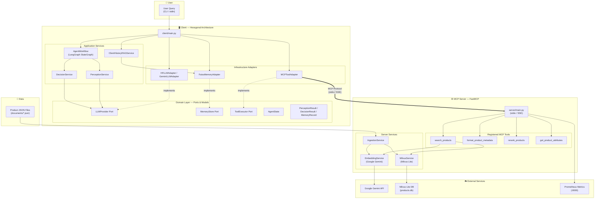
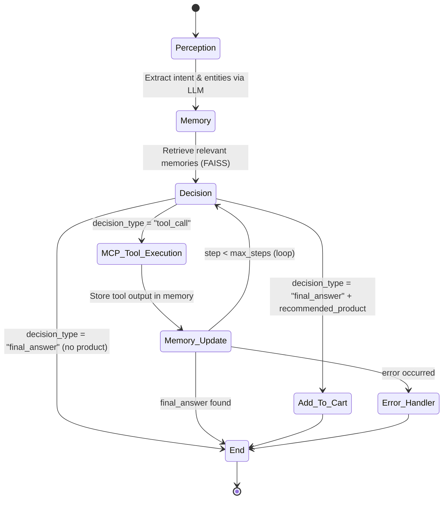
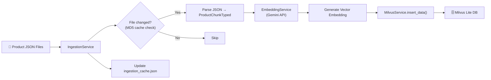
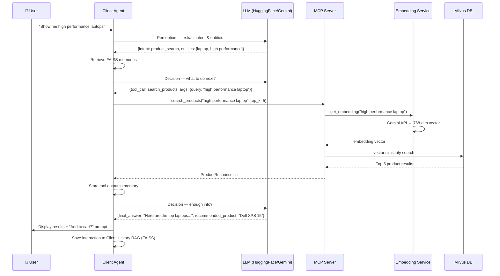

# 🤖 GenAI Product Recommendation Engine

A production-ready, **Hexagonal Architecture** (Ports and Adapters) implementation of an Agentic AI system for E-commerce Product Discovery. This system leverages **LangGraph** for orchestration, **Google Gemini & Hugging Face** for reasoning, **Milvus** for vector storage, and the **Model Context Protocol (MCP)** for standardized tool execution.

---

## 🏗️ Architecture: Hexagonal & Domain-Driven

This project strictly follows **Hexagonal Architecture** to decouple the core business logic from external tools and frameworks. This ensures testability, maintainability, and the ability to swap infrastructure components (like LLMs or Vector DBs) without touching the core agent logic.

### The Architecture Components

#### 🔵 **Client (Agentic System)**

1.  **🟢 Domain Layer (`client/domain/`)**
    *   **The Core**: Contains pure business logic, data models, and interface definitions (Ports).
    *   **No Dependencies**: This layer *never* imports external infrastructure libraries (like `google.genai` or `milvus`). It only uses Python standard libraries and Pydantic.
    *   **Subdomains**: Structured by bounded contexts:
        *   `perception/`: Logic for understanding user intent
        *   `decision/`: Logic for planning and reasoning
        *   `memory/`: Conversation history and context management
        *   `tools/`: Tool interface definitions
        *   `shared/`: Shared state models
        *   `llm/`: LLM port definitions

2.  **🟡 Application Layer (`client/application/`)**
    *   **The Orchestrator**: Wires the Domain Logic together to perform Use Cases.
    *   **Services**: 
        *   `perception.py`: User intent understanding
        *   `reasoning.py`: Decision-making and planning
        *   `agent_orchestrator.py`: LangGraph workflow orchestration
        *   `client_history_rag.py`: Client conversation history retrieval

3.  **🔴 Infrastructure Layer (`client/infrastructure/`)**
    *   **The Adapters**: Technical implementations of the Domain Ports.
    *   `llm/`: LLM adapters (Gemini, Hugging Face)
    *   `memory/`: FAISS-based memory adapter
    *   `tools/`: MCP tool adapter for server communication

#### 🟠 **Server (MCP Server & RAG Engine)**

*   **Purpose**: Standalone FastMCP server providing product search and metadata tools
*   **Components**:
    *   `services/`: Milvus, embedding, and ingestion services
    *   `tools/`: Product search and ranking tools exposed via MCP
    *   `models/`: Product data models
    *   `config/`: Server configuration and settings

#### 🟣 **Infrastructure & Deployment**

*   `k8s/`: Kubernetes manifests with ArgoCD configuration
*   `tests/`: Unit and E2E tests
*   `pyproject.toml`: Project dependencies and metadata

---

## 📂 Project Structure

```text
GenAI-Product-Recommandation-Engine/
├── pyproject.toml              # Project configuration & dependencies
├── README.md                   # This file
│
├── client/                     # 🔵 AGENTIC CLIENT
│   ├── main.py                 # Entry point (Dependency Injection)
│   ├── Dockerfile              # Client containerization
│   ├── requirements.txt        # Client dependencies
│   ├── domain/                 # CORE: Models & Ports (Interfaces)
│   │   ├── decision/           # Decision-making models
│   │   │   └── models.py
│   │   ├── llm/                # LLM port definitions
│   │   │   └── llm_port.py
│   │   ├── memory/             # Memory interfaces
│   │   │   ├── memory_port.py
│   │   │   └── models.py
│   │   ├── perception/         # Intent understanding models
│   │   │   └── models.py
│   │   ├── shared/             # Shared state
│   │   │   └── state.py
│   │   └── tools/              # Tool definitions
│   │       ├── models.py
│   │       └── tool_port.py
│   ├── application/            # ORCHESTRATION: Business Logic
│   │   └── services/
│   │       ├── agent_orchestrator.py    # LangGraph workflow
│   │       ├── client_history_rag.py    # Conversation retrieval
│   │       ├── perception.py            # Intent analysis
│   │       └── reasoning.py             # Decision service
│   ├── infrastructure/         # ADAPTERS: External integrations
│   │   ├── llm/
│   │   │   ├── gemini_adapter.py        # Google Gemini adapter
│   │   │   └── huggingface_adapter.py   # HuggingFace adapter
│   │   ├── memory/
│   │   │   └── faiss_memory_adapter.py  # FAISS memory store
│   │   └── tools/
│   │       └── mcp_tool_adapter.py      # MCP client adapter
│   └── utils/
│       └── logger.py           # Logging utilities
│
├── server/                     # 🟠 MCP SERVER & RAG ENGINE
│   ├── main.py                 # FastMCP server entry point
│   ├── pipeline.py             # Data processing pipeline
│   ├── Dockerfile              # Server containerization
│   ├── requirements.txt        # Server dependencies
│   ├── config/
│   │   └── settings.py         # Server configuration (Milvus, etc.)
│   ├── models/
│   │   └── products.py         # Product data models
│   ├── services/
│   │   ├── embedding_service.py    # Text embedding generation
│   │   ├── ingestion_service.py    # Data ingestion logic
│   │   └── milvus_service.py       # Milvus vector DB operations
│   ├── tools/
│   │   └── product_tools.py    # MCP tools (search, rank, analyze)
│   └── utils/
│       └── logger.py           # Server logging
│
├── k8s/                        # ☸️ KUBERNETES DEPLOYMENT
│   ├── argocd-app.yaml         # ArgoCD application definition
│   ├── common/
│   │   ├── configmap.yaml      # ConfigMaps
│   │   ├── namespace.yaml      # Namespace definition
│   │   └── secrets.yaml        # Secrets (API keys, etc.)
│   ├── client/
│   │   └── deployment.yaml     # Client deployment
│   └── server/
│       ├── deployment.yaml     # Server deployment
│       └── service.yaml        # Server service
│
└── tests/                      # 🧪 TESTS
    ├── conftest.py             # Pytest configuration
    ├── e2e/
    │   └── test_workflow.py    # End-to-end workflow tests
    └── unit/
        ├── application/        # Application layer tests
        │   ├── test_perception_service.py
        │   └── test_reasoning_service.py
        ├── domain/             # Domain model tests
        │   └── test_models.py
        └── infrastructure/     # Infrastructure adapter tests
            ├── test_llm_adapter.py
            ├── test_memory_adapter.py
            └── test_tool_adapter.py
```

---

## 🚀 Key Features

### 🤖 **Agentic AI System**
- **Cognitive Cycle**: Implements a `Perceive → Remember → Decide → Act` loop using LangGraph
- **Multi-LLM Support**: Seamlessly switch between Google Gemini and Hugging Face models
- **Structured Reasoning**: Uses Pydantic models to enforce structured output, reducing hallucinations
- **Conversation Memory**: FAISS-based memory for context-aware interactions

### 🔧 **Model Context Protocol (MCP)**
- **Standardized Tool Execution**: All product search tools exposed via MCP standard
- **Microservices Architecture**: Separate client (agent) and server (tools) components
- **FastMCP Framework**: Modern, fast MCP server implementation

### 🔍 **Advanced RAG Engine**
- **Vector Search**: Milvus Lite for high-performance vector similarity search
- **Smart Embedding**: Google's text-embedding-004 model (768 dimensions)
- **Product Ranking**: Multi-stage ranking and refinement tools
- **Metadata Analysis**: Advanced filtering and re-ranking capabilities

### ☁️ **Cloud-Native Deployment**
- **Kubernetes Ready**: Complete K8s manifests with ArgoCD GitOps
- **Containerized**: Docker support for both client and server
- **Scalable**: Microservices architecture for independent scaling
- **Observable**: Prometheus metrics integration

### 🧪 **Production Quality**
- **Hexagonal Architecture**: Clean separation of concerns
- **Comprehensive Testing**: Unit and E2E test coverage
- **Type Safety**: Full Pydantic model validation
- **Logging**: Structured logging throughout

---

## 🛠️ Setup & Usage

### Prerequisites
- Python 3.10 (specifically, not 3.11+)
- Google Gemini API Key (or Hugging Face token)
- Docker (optional, for containerized deployment)
- Kubernetes cluster (optional, for production deployment)

### Local Development Setup

#### 1. Clone the Repository
```bash
git clone https://github.com/d-sutariya/GenAI-Product-Recommandation-Engine.git
cd GenAI-Product-Recommandation-Engine
```

#### 2. Environment Configuration
Create a `.env` file in the root directory:
```ini
# Required: LLM API Key
GEMINI_API_KEY=your_gemini_api_key_here

# Optional: MCP Server URL (if running separately)
MCP_SERVER_URL=http://localhost:8000/sse

# Optional: HuggingFace Token (if using HF models)
HUGGINGFACE_TOKEN=your_hf_token_here
```

#### 3. Install Dependencies

**For Client:**
```bash
cd client
pip install -r requirements.txt
```

**For Server:**
```bash
cd server
pip install -r requirements.txt
```

**Or use the project-wide dependencies:**
```bash
# From project root
pip install -e .
```

#### 4. Run the MCP Server

The server handles product search and RAG operations:

```bash
cd server
python main.py
```

The server will:
- Initialize Milvus Lite vector database
- Ingest product data (if not already done)
- Start FastMCP server on `http://localhost:8000`

#### 5. Run the Client Agent

In a new terminal, start the agent:

```bash
cd client
python main.py
```

The agent will:
- Connect to the MCP server
- Start an interactive conversation loop
- Process your product queries using LangGraph workflow

### Example Queries

```text
"Find me Nike running shoes under $100"
"Show me waterproof hiking backpacks"
"I need a formal watch for business meetings"
"Looking for casual summer dresses"
```

---

## 🐳 Docker Deployment

### Build Images

**Server:**
```bash
cd server
docker build -t product-recommendation-server:latest .
```

**Client:**
```bash
cd client
docker build -t product-recommendation-client:latest .
```

### Run with Docker

**Start Server:**
```bash
docker run -p 8000:8000 \
  -e GEMINI_API_KEY=your_key \
  product-recommendation-server:latest
```

**Start Client:**
```bash
docker run -it \
  -e GEMINI_API_KEY=your_key \
  -e MCP_SERVER_URL=http://server:8000/sse \
  product-recommendation-client:latest
```

---

## ☸️ Kubernetes Deployment

### Using ArgoCD (Recommended)

1. **Install ArgoCD** in your cluster
2. **Apply the ArgoCD Application:**
   ```bash
   kubectl apply -f k8s/argocd-app.yaml
   ```

3. **Configure Secrets:**
   ```bash
   kubectl create secret generic app-secrets \
     --from-literal=GEMINI_API_KEY=your_key \
     -n product-recommendation
   ```

### Manual Kubernetes Deployment

```bash
# Create namespace and common resources
kubectl apply -f k8s/common/

# Deploy server
kubectl apply -f k8s/server/

# Deploy client
kubectl apply -f k8s/client/
```

---

## 🧠 Cognitive Flow (How It Works)

### High-Level Architecture



### Agent Workflow — LangGraph State Machine



### Data Ingestion Pipeline



### Runtime Search / RAG Sequence



### Detailed Flow

1. **Perception Service** → Analyzes user intent, extracts entities (brand, category, price, etc.)
2. **Memory Service** → Retrieves conversation history and user preferences from FAISS
3. **Decision Service** → LLM decides what action to take (search, clarify, answer)
4. **MCP Tool Execution** → Calls product search tools on the server
5. **RAG Engine** → Milvus vector search finds semantically similar products
6. **Ranking & Refinement** → Advanced filtering based on user criteria
7. **Response Generation** → Natural language response with product recommendations

---

## 🧪 Testing

### Run Unit Tests
```bash
pytest tests/unit/ -v
```

### Run E2E Tests
```bash
pytest tests/e2e/ -v
```

### Run All Tests with Coverage
```bash
pytest tests/ -v --cov=client --cov=server --cov-report=html
```

---

## 🔄 Architecture Benefits

### Why Hexagonal Architecture?

✅ **Testability**: Domain logic can be tested without external dependencies  
✅ **Flexibility**: Swap LLMs (Gemini ↔ HuggingFace) or vector DBs (Milvus ↔ FAISS) easily  
✅ **Maintainability**: Clear boundaries between business logic and infrastructure  
✅ **Scalability**: Independent scaling of client and server components  

### Why MCP?

✅ **Standardization**: Industry-standard protocol for AI tool integration  
✅ **Interoperability**: Works with any MCP-compatible client  
✅ **Extensibility**: Easy to add new tools without changing agent code  
✅ **Separation**: Clean separation between reasoning and tool execution  

---

## 📊 Tech Stack

| Component | Technology | Purpose |
|-----------|-----------|---------|
| **Orchestration** | LangGraph | Agent workflow state machine |
| **LLM** | Google Gemini, HuggingFace | Reasoning and language understanding |
| **Vector DB** | Milvus Lite | Product embeddings storage |
| **Embeddings** | text-embedding-004 | Text to vector conversion |
| **Memory** | FAISS | Conversation history |
| **Protocol** | FastMCP | Tool execution standard |
| **Framework** | FastAPI | HTTP server (MCP) |
| **Container** | Docker | Application containerization |
| **Orchestration** | Kubernetes | Production deployment |
| **GitOps** | ArgoCD | Continuous deployment |
| **Testing** | Pytest | Unit and E2E tests |
| **Validation** | Pydantic | Type safety and validation |

---

## 📝 Contributing

Contributions are welcome! Please:

1. Fork the repository
2. Create a feature branch (`git checkout -b feature/amazing-feature`)
3. Commit your changes (`git commit -m 'Add amazing feature'`)
4. Push to the branch (`git push origin feature/amazing-feature`)
5. Open a Pull Request

---

## 📄 License

This project is licensed under the MIT License - see the LICENSE file for details.

---

## 🙏 Acknowledgments

- **Anthropic** for the Model Context Protocol specification
- **Google** for Gemini API and embedding models
- **Hugging Face** for open-source models and ecosystem
- **Milvus** for vector database technology
- **LangChain/LangGraph** for agent orchestration framework

---

## 📧 Contact

**Deep Sutariya**
- GitHub: [@d-sutariya](https://github.com/d-sutariya)
- Project Link: [GenAI-Product-Recommandation-Engine](https://github.com/d-sutariya/GenAI-Product-Recommandation-Engine)

---

**⭐ If you find this project useful, please consider giving it a star!**
